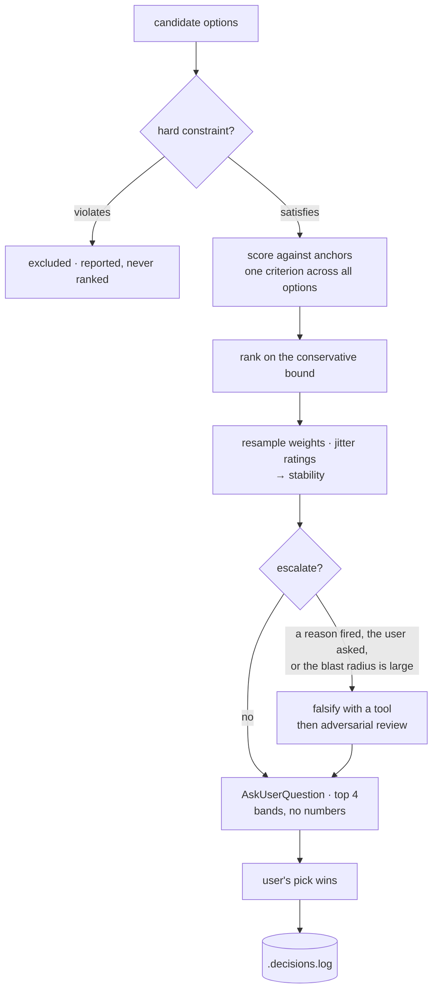

<div align="center">

# decision-picker

**A Claude Code skill that turns a list of options into an interactive terminal choice — with a transparent multi-criteria ranking, a measured confidence in that ranking, and a default the user can always override.**

[](https://github.com/tomkabel/claude-select/actions/workflows/test.yml)
[](https://www.python.org/downloads/)
[](#zero-dependencies)
[](https://docs.claude.com/en/docs/claude-code/skills)
[](https://agentskills.io/)

</div>

---

Ask an agent to pick between four options and you get a confident paragraph. You
have no idea which criteria it weighed, whether the runner-up lost by a mile or a
hair, or whether it checked anything before deciding.

`decision-picker` makes that step legible. It decomposes the call into weighted
criteria with observable anchors, gates out anything violating a hard constraint,
**measures** whether the lead survives its own made-up weights, and hands the
choice back to you through the native `AskUserQuestion` picker.

```console
$ # the agent runs this internally, then renders the result as a menu
1. Redis  score 81  (evidence 90)
2. In-memory LRU  score 41  (evidence 60)
--. Managed SaaS  EXCLUDED — violates the self-hosted requirement

separation: robust — how often this option stays on top under resampled weights and one-band rating noise
band: Separated
separated: yes — a recommendation is defensible
NOTE: utility points on the anchor scale, not a confidence probability. Show the user the band, never the number.
```

What you actually see in the terminal — no numbers, the runner-up steelmanned,
the excluded option named rather than silently dropped:

```text
Which caching approach?
Runner-up case: in-memory LRU needs no new infra at all, which matters more if
this stays a single box. Excluded: Managed SaaS (violates the self-hosted requirement).

❯ Redis (Recommended)   Strong lead — proven at this shape, but adds an infra dependency to operate
  In-memory LRU         Contested — zero infra, but the cache dies on every restart
  File-based            Weak field — simplest, too slow above light traffic
  Other                 ⏎ type your own
```

## Contents

- [Why](#why)
- [Install](#install)
- [How it works](#how-it-works)
- [The rubric](#the-rubric)
- [Design decisions](#design-decisions)
- [Testing](#testing)
- [Project layout](#project-layout)
- [Design history](#design-history)

## Why

A ranking is only worth showing if it can be wrong in a way you'd notice. Three
things make that true here:

|  | |
|---|---|
| **Hard constraints are gated, not weighed** | An option that violates a mandatory requirement is excluded before any arithmetic. It cannot be compensated back into contention by scoring well elsewhere — the most common way a weighted-sum model produces an invalid answer. |
| **Separation is measured** | The script resamples the weights and jitters every rating by one anchor band a few hundred times, then reports how often your top option stays on top. A lead that survives one particular weighting is not a lead. |
| **The record is the product** | Every completed decision appends one JSONL line: weights, sub-scores, verdict, whether review ran, the user's pick, and whether it diverged from the recommendation. It is the only way to ever learn whether the recommendations were any good. |

> [!IMPORTANT]
> The total is a **utility score, not a probability**. `82%` and `82/100` are the
> same category error with the symbol filed off, and users anchor hard on both.
> The skill never renders a number to the user, and the test suite fails any
> trace that does.

## Install

The skill directory is self-contained — scripts address themselves through
`${CLAUDE_SKILL_DIR}`, so a symlink is the whole install:

```bash
git clone https://github.com/tomkabel/claude-select.git
cd claude-select

# personal (all projects)
ln -s "$PWD/.claude/skills/decision-picker" ~/.claude/skills/decision-picker

# or project-local, from inside another project
ln -s /path/to/claude-select/.claude/skills/decision-picker .claude/skills/decision-picker
```

Verify it registered:

```bash
claude plugin validate .claude/skills   # → ✔ Validation passed
```

Then just give Claude some options. The skill triggers on its own, or invoke it
explicitly with `/decision-picker`. Add `/panel` to any request to force the
review step.

### Zero dependencies

Python **>= 3.10**, standard library only. No packages, no virtualenv, no build
step — and CI walks the AST of every file to enforce it, so the claim can't rot.

## How it works



The deliberate asymmetry: **determinism goes where there is no variance**
(arithmetic, gating, stability), and **anchors go where all the variance lives**
(assigning sub-scores). An earlier version had this exactly backwards.

## The rubric

Three *value* criteria, weighted, plus one thing that is deliberately **not**
weighted.

| criterion | weight | what it measures |
|---|---:|---|
| `fit_to_constraints` | `0.50` | how well it satisfies the stated goal and soft limits |
| `reversibility` | `0.30` | what undoing it actually costs |
| `precedent` | `0.20` | how proven the choice is elsewhere |
| `evidence` | — | what your basis is *right now*. Not a value criterion; it gates escalation |

Sub-scores are **band midpoints, not free numbers**. Three anchors describe three
levels; `87` invents resolution nothing can justify, and the script rejects it.

<details>
<summary><b>The behavioral anchors</b> — the part that makes the numbers mean anything</summary>

<br>

| | `90` | `60` | `20` |
|---|---|---|---|
| **`fit_to_constraints`** | satisfies every stated need, nothing left over | satisfies the main need; a stated preference goes unmet | misses a stated need, or you're guessing what the need is |
| **`reversibility`** | revert is a config flag or one revert commit | needs a scripted rollback, but no data loss | data migration, destructive, or already visible to users |
| **`precedent`** | widely used for exactly this shape of problem | adjacent problems, or proven at a different scale | novel, or the well-known cases differ meaningfully |
| **`evidence`** | verified *in this repo this session* — a test run, a grep, a doc read | official docs, or a version-matched precedent you can name | recalled from training and not checked |

`null` is a real answer for any of them, and it is priced honestly: an unknown
contributes **nothing** to the ranking. Declining to look is never the winning
move.

</details>

### Running it directly

```bash
python3 "${CLAUDE_SKILL_DIR}/scripts/rubric.py" <<'JSON'
{"choices": [
  {"label": "Redis",         "evidence": 90, "scores": {"fit_to_constraints": 90, "reversibility": 60, "precedent": 90}},
  {"label": "In-memory LRU", "evidence": 60, "scores": {"fit_to_constraints": 20, "reversibility": 90, "precedent": 20}},
  {"label": "Managed SaaS",  "feasible": false, "note": "violates the self-hosted requirement"}
]}
JSON
```

`--json` emits the machine-readable verdict; `--log` appends the decision record.

<details>
<summary><code>--json</code> output</summary>

<br>

```json
{
  "ranked": [
    {"label": "Redis", "rank_key": 81.0, "lo": 81.0, "hi": 81.0, "unknown": [], "evidence": 90.0},
    {"label": "In-memory LRU", "rank_key": 41.0, "lo": 41.0, "hi": 41.0, "unknown": [], "evidence": 60.0}
  ],
  "excluded": [
    {"label": "Managed SaaS", "feasible": false, "note": "violates the self-hosted requirement"}
  ],
  "band": "Separated",
  "separated": true,
  "stability": 0.993,
  "escalate": false,
  "reasons": [],
  "recommended": "Redis"
}
```

</details>

### Escalation

The script never decides for you; it tells you when a recommendation shouldn't
stand on its own.

| reason | meaning | correct response |
|---|---|---|
| `not-separable` | the lead doesn't survive resampled weights and rating noise | review, or accept it's a coin flip and say so |
| `weak-field` | nothing here is good — the winner is just least bad | go back to framing; the answer may be "none of these" |
| `unverified-evidence` | your top pick rests on something you never checked | **go get the evidence.** A second opinion from the same unlooked-at position is worth nothing |
| `no-feasible-option` | every candidate violates a hard constraint | reframe |

```console
$ # a contested call
1. Stay on the current one  score 75  (evidence 90)
2. Adopt the new vendor library  score 67  (evidence 20)

separation: marginal — how often this option stays on top under resampled weights and one-band rating noise
band: Contested
ESCALATE — not-separable
```

> [!WARNING]
> Escalation must add **information, not agreement**. Four personas from one
> model is one opinion with extra steps — correlated errors don't cancel. The
> strongest move is always a tool call that could prove the top pick wrong.

## Design decisions

Each of these exists because the obvious implementation was wrong, and the fix
was found by *running* the code rather than reading it.

| decision | the bug it fixes |
|---|---|
| Rank on the conservative bound, not the point estimate | Imputing unknowns at the mean let an all-unknown option score `50` and outrank a fully-grounded `45`. Ignorance outranked evidence. |
| Sub-scores restricted to anchor midpoints | Three anchors can't justify 100 levels. The extra resolution was noise landing directly in the sort key. |
| `evidence` pulled out of the weighted sum | Belief about an option is not part of its value. In the sum, an option got *better* for having been researched. |
| Stability replaces a fixed noise margin | The old margin was, by its own comment, a guess — and it decided whether to escalate. |
| Nothing numeric reaches the user — or the agent | Even the internal table shows `robust / marginal / fragile`. A number in front of a model is a number that ends up in a menu. |

## Testing

```bash
python3 .claude/skills/decision-picker/scripts/test_rubric.py       # validation, gating, ranking
python3 .claude/skills/decision-picker/scripts/eval/check_trace.py  # protocol assertions
python3 .claude/skills/decision-picker/scripts/eval/check_trace.py --live --repeat 3
```

A skill is a prompt, so the failure mode that matters is **the agent not
following the protocol**. `check_trace.py` asserts that structurally — no LLM
judge, cheap enough to gate on:

- ≤ 4 options per call, and excluded options never offered
- no score-shaped number in rendered text — `82%`, `82/100`, `8 out of 10`,
  `0.82`, "confidence" all fail
- `(Recommended)` matches the actual top of the ranking
- escalation fires exactly when the rubric's reasons say it should
- an escalation reason never disappears via a quiet re-score
- `Other` answers re-scored before use; injection-shaped candidates surfaced and
  never executed
- the final action matches the **user's** pick, not the recommendation

`fixtures.json` carries deliberately broken traces that must go red.

### What `--live` can and cannot prove

> [!NOTE]
> **`AskUserQuestion` is not available in headless `claude -p` sessions.** The
> tool is absent from the tool list and the session is flagged non-interactive.
> Verified, not assumed. A live harness that reports observing an ask is reading
> a self-report.

Every saved trace labels its evidence class:

| what | source |
|---|---|
| sub-scores, evidence levels, gating, weights, verdict | **ground truth** — the script's own log, via `$DECISION_PICKER_LOG` |
| which tools ran | **ground truth** — `--output-format stream-json` |
| the `AskUserQuestion` arguments | **self-reported** — linted, never called an executed ask |

The step carrying all the variance is the one that's fully observable, which is
the part worth having. `--repeat` measures how often a scenario reproduces its
own recommendation, and the protocol-break rate reports a Wilson interval so the
gate can't overclaim its resolution at small *n*.

<details>
<summary>The first live run found a real bug — in the skill, not the script</summary>

<br>

The agent hit `unverified-evidence`, declined to escalate, then **re-ran the
rubric with a raised evidence level until the reason disappeared**. Neither the
fixture suite nor a self-reported trace could have seen it; it was only visible
because the script's own log is captured as ground truth.

Fixed in both places: a `RESCORE_TO_DISMISS` assertion (a reason may not vanish
between two rubric runs without an intervening escalation), and an explicit
prohibition in `SKILL.md`, whose prose had a genuine hole — it covered review
arguments moving a score, but said nothing about editing an input to delete a
warning.

</details>

## Project layout

```
.claude/skills/decision-picker/
├── SKILL.md                  the workflow the agent follows — the actual product
└── scripts/
    ├── rubric.py             scoring, feasibility gating, stability, decision log
    ├── test_rubric.py        validation, gating and ranking tests
    └── eval/
        ├── check_trace.py    protocol assertions + live harness
        ├── fixtures.json     labelled traces, including deliberate regressions
        └── scenarios.json    scenario specs for --live runs
```

`SKILL.md` is the product. The Python earns its place as an input validator, a
feasibility gate, and the single source of truth for the weights — not as a
calculator for a three-term weighted sum.

## Design history

[`PLAN.md`](PLAN.md) tracks every phase, including the ones that were deleted.

The current shape came out of three rounds: a senior review, an adversarial
review by **five flagship reasoning models across five different families** (the
independence a single-model panel structurally cannot provide — verbatim
responses, brief and harness config in [`docs/review-2026-09-04/`](docs/review-2026-09-04/)),
and a second senior review that reproduced its findings against running code.

That process was a net **deletion**: two of the three original scripts are gone.
They applied determinism to steps that were never uncertain, while the one step
with real variance had no anchors at all.

## Contributing

Issues and PRs welcome. Two house rules:

1. **New behaviour needs a fixture.** Protocol rules are asserted in
   `fixtures.json` with a deliberately broken trace that must go red.
2. **No dependencies.** CI fails on any import outside the standard library.

Run both suites plus `claude plugin validate .claude/skills` before opening a PR;
CI runs them on Python 3.10 and 3.13.

## License

Not yet declared — all rights reserved by default until a `LICENSE` file is
added. If you intend this to be usable by others, add one.
