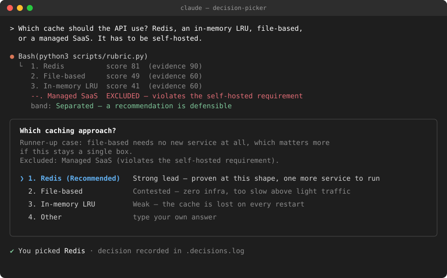
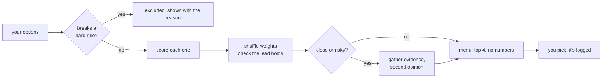

# tiltrank

**Give your AI agent a few options. It scores them openly, drops the ones that break your rules, and lets you make the final pick from a menu.**

The name comes from the stability check: tiltrank tilts the weights a few hundred times and reports whether the top pick still wins.

Works as a skill in **Claude Code**, **Hermes Agent**, and **pi**. Pure Python, no dependencies.

[](https://github.com/tomkabel/tiltrank/actions/workflows/test.yml)
[](https://www.python.org/downloads/)
[](#requirements)
[](https://docs.claude.com/en/docs/claude-code/skills)
[](https://hermes-agent.nousresearch.com/docs)
[](https://github.com/badlogic/pi-mono)
[](https://agentskills.io/)

<p align="center">
  
</p>

## The problem

Ask an agent "which of these four should I use?" and you get one confident
paragraph. You can't tell what it weighed, whether the runner-up lost by a mile
or a hair, or whether it checked anything first.

## What tiltrank does instead

1. **Drops options that break a hard rule.** "Must be self-hosted" takes out the
   SaaS option before any scoring, and the menu tells you it was removed and why.
2. **Scores the rest against fixed descriptions** (fit, reversibility, how proven
   it is), so a score means the same thing every time.
3. **Checks whether the winner really wins.** It shuffles the weights and ratings
   a few hundred times. If the leader keeps changing, it says the call is contested.
4. **Asks you.** You get a normal menu in your agent's own UI: the top pick
   marked *(Recommended)*, the runner-up's best argument, and an *Other* option.
   Your pick wins, and it gets logged.

You never see percentages or "82/100". Those numbers are utility scores, not
probabilities, and people read too much into them. The menu shows plain labels
like *Strong lead*, *Contested*, and *Weak*.

## Quick start

```bash
git clone https://github.com/tomkabel/tiltrank.git
cd tiltrank
ln -s "$PWD/.claude/skills/tiltrank" ~/.claude/skills/tiltrank
```

That's the whole install for Claude Code. Then ask your agent to choose between
some options:

> Pick a queue for the job runner: Redis streams, RabbitMQ, or Postgres `SKIP LOCKED`. We can't add new infra.

The skill triggers by itself. You can also call it with `/tiltrank`, or
add `/panel` to force a second-opinion review.

<details>
<summary><b>Hermes Agent and pi install</b></summary>

<br>

**Hermes Agent**: register the directory instead of symlinking it. Hermes'
skill-editing tools don't follow symlinked directories:

```bash
hermes config set skills.external_dirs '["'"$PWD"'/.claude/skills"]'
```

**pi**: use a real directory that contains symlinks (pi's discovery won't
descend into a symlinked directory), then install the extension that provides the
menu:

```bash
mkdir -p ~/.agents/skills/tiltrank
ln -sfn "$PWD/.claude/skills/tiltrank/SKILL.md" ~/.agents/skills/tiltrank/SKILL.md
ln -sfn "$PWD/.claude/skills/tiltrank/scripts" ~/.agents/skills/tiltrank/scripts
ln -sfn ../../.agents/skills/tiltrank ~/.pi/agent/skills/tiltrank
pi install "$PWD"
```

Details: [`docs/porting-hermes-pi.md`](docs/porting-hermes-pi.md).

</details>

### Requirements

- Python 3.10 or newer, standard library only. No packages, no virtualenv. CI
  rejects any non-stdlib import.
- Claude Code, Hermes Agent, or pi to show the menu.

## How it decides



### The scorecard

| criterion | weight | question it answers |
|---|---:|---|
| `fit_to_constraints` | 0.50 | Does it do what you asked, within your limits? |
| `reversibility` | 0.30 | How painful is it to undo? |
| `precedent` | 0.20 | Has this been done before for this kind of problem? |
| `evidence` | not weighted | Did the agent check this, or is it from memory? Weak evidence triggers a review instead of changing the score. |

Each score has to be one of three levels: `90`, `60`, or `20`. Values like `87`
are rejected because three written descriptions can't support that much
precision. An unknown (`null`) counts as zero, so an option can't win by never
being checked.

<details>
<summary><b>What each level means</b></summary>

<br>

| | `90` | `60` | `20` |
|---|---|---|---|
| **fit_to_constraints** | meets every stated need | meets the main need, misses a preference | misses a need, or the need is a guess |
| **reversibility** | config flag or one revert commit | scripted rollback, no data loss | data migration, destructive, or already user-visible |
| **precedent** | widely used for exactly this | used for similar problems or at another scale | new, or the known cases differ |
| **evidence** | verified in this repo this session | official docs or a named precedent | remembered from training, not checked |

</details>

### When it asks for a second look

| signal | meaning | what the agent does |
|---|---|---|
| `not-separable` | the lead flips when weights shift | reviews, or tells you it's a coin flip |
| `weak-field` | every option is poor | reconsiders the question; maybe none of these |
| `unverified-evidence` | the top pick was never checked | runs a test, grep, or doc lookup |
| `no-feasible-option` | everything breaks a hard rule | asks you to relax a rule |

The second look has to bring in new information, such as a tool call that could
prove the top pick wrong. The same model arguing with itself four times doesn't
count.

## Run the scorer yourself

The agent normally calls this script for you. To run it by hand:

```bash
python3 .claude/skills/tiltrank/scripts/rubric.py <<'JSON'
{"choices": [
  {"label": "Redis",         "evidence": 90, "scores": {"fit_to_constraints": 90, "reversibility": 60, "precedent": 90}},
  {"label": "In-memory LRU", "evidence": 60, "scores": {"fit_to_constraints": 20, "reversibility": 90, "precedent": 20}},
  {"label": "Managed SaaS",  "feasible": false, "note": "violates the self-hosted requirement"}
]}
JSON
```

```console
1. Redis  score 81  (evidence 90)
2. In-memory LRU  score 41  (evidence 60)
--. Managed SaaS  EXCLUDED — violates the self-hosted requirement

separation: robust — how often this option stays on top under resampled weights and one-band rating noise
band: Separated
separated: yes — a recommendation is defensible
NOTE: utility points on the anchor scale, not a confidence probability. Show the user the band, never the number.
```

Add `--json` for machine-readable output and `--log` to append the decision to
`.decisions.log`, or set `$TILTRANK_LOG`. Each record holds the weights,
scores, verdict, your pick, and whether you overrode the recommendation, so you
can later check whether the recommendations held up.

## Testing

```bash
S=.claude/skills/tiltrank/scripts
python3 $S/test_rubric.py          # scoring, gating, validation
python3 $S/eval/check_trace.py     # agent-behaviour checks on recorded traces
python3 $S/eval/check_trace.py --live --driver claude --repeat 3   # real sessions, costs tokens
```

A skill is a prompt, so the main risk is the agent not following it.
`check_trace.py` fails a trace if the agent:

- offers more than 4 options, or offers an excluded one
- shows a score-like number (`82%`, `82/100`, `0.82`, "confidence")
- marks the wrong option *(Recommended)*
- skips a required review, or re-scores to make a warning go away
- runs an *Other* answer that looks like an injected command
- acts on anything other than your pick

Every rule has a deliberately broken example in `fixtures.json` that must fail.

<details>
<summary><b>Live eval results and limits</b></summary>

<br>

The offline suite runs in CI. A full live pass on Hermes (15 scenarios × 3
repeats, 2026-09-21) broke protocol in 17.8% of runs (95% CI 9.3–31.3%), above
the 10% gate. These are genuine model deviations, not harness bugs. See
[PLAN.md](PLAN.md).

Headless `claude -p` has no `AskUserQuestion` tool, so menu contents in live runs
are self-reported by the agent. Scores, gating, and verdicts come from the
script's own log and are ground truth.

The first live run caught the agent bumping an evidence score to make the
`unverified-evidence` warning disappear. That's now a test (`RESCORE_TO_DISMISS`)
and an explicit rule in `SKILL.md`.

</details>

<details>
<summary><b>Design decisions</b></summary>

<br>

| decision | why |
|---|---|
| Rank on the conservative bound | Filling unknowns with the average let an all-unknown option outrank a fully checked one. |
| Only three score levels | Three descriptions can't justify 100 levels; the extra precision was noise. |
| `evidence` kept out of the score | Researching an option doesn't make it better. |
| Measured stability instead of a fixed margin | The old margin was a guess, and it decided when to escalate. |
| No numbers shown to user or agent | A number the agent sees tends to end up in the menu. |

The design came from three review rounds, including an adversarial review by
five models from different families ([`docs/review-2026-09-04/`](docs/review-2026-09-04/)).
The net result was deleting two of the three original scripts.

</details>

## Project layout

```
.claude/skills/tiltrank/
├── SKILL.md              the workflow the agent follows (the actual product)
└── scripts/
    ├── rubric.py         scoring, rule gating, stability, decision log
    ├── test_rubric.py    unit tests
    └── eval/
        ├── check_trace.py   behaviour checks + live harness
        ├── fixtures.json    recorded traces, including broken ones
        └── scenarios.json   scenarios for --live runs
extensions/tiltrank.ts   pi menu tool and /panel
```

## Contributing

Issues and PRs welcome. Two rules:

1. **New behaviour needs a fixture**, including a broken trace that must fail.
2. **No dependencies.**

Run both test suites and `claude plugin validate .claude/skills` before opening a
PR. See [CONTRIBUTING.md](CONTRIBUTING.md), [CHANGELOG.md](CHANGELOG.md), and
[PLAN.md](PLAN.md) for design history.

## License

MIT, see [LICENSE](LICENSE).
